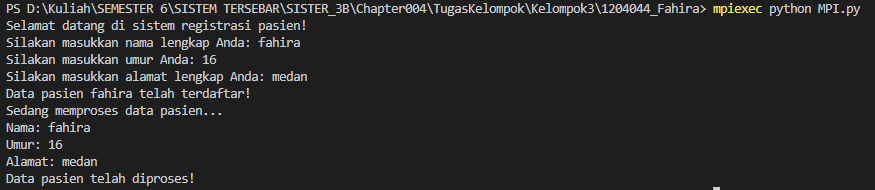

## Deskripsi Kode Program Chapter 04

### Nama : Fahira 
### NPM : 1204044

Pada tugas chapter 004 ini menggunakan MPI (Message Passing Interface) untuk menerapkan sebuah studi kasus registrasi pasien. Program terdiri dari dua jenis proses dengan rank 0 dan rank 1.

Pada awal program, setiap proses memanggil fungsi MPI.COMM_WORLD untuk membuat komunikator baru dan kemudian memperoleh rank-nya dengan menggunakan comm.rank.

Jika rank = 0, maka proses tersebut adalah proses utama untuk registrasi pasien. Proses utama akan meminta input dari pengguna seperti nama, umur, dan alamat pasien menggunakan fungsi input(). Setelah pengguna mengisi data pasien, data tersebut akan dikirimkan ke proses dengan rank 1 menggunakan fungsi comm.send().

Jika rank = 1, maka proses tersebut adalah proses untuk memproses data pasien. Proses ini akan menerima data pasien yang telah dikirimkan oleh proses dengan rank 0 menggunakan fungsi comm.recv(). Setelah itu, proses tersebut akan memproses data pasien dan menampilkannya dengan menggunakan fungsi print().

Hasil dari program akan menampilkan informasi yang telah diisi oleh pengguna seperti nama, umur, dan alamat pasien.

## Hasil ketika di run :
