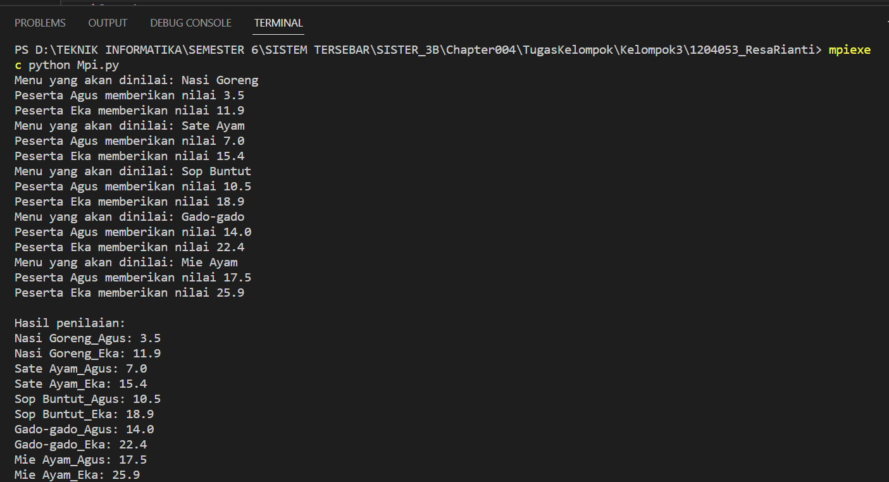

Nama : Resa Rianti
Npm  : 1204053
Kelas : D4 Teknik Informatika 3B
Studi Kasus : Master Chef

Implementasi program paralel menggunakan MPI (Message Passing Interface) dalam bahasa pemrograman Python. Program ini bertujuan untuk mensimulasikan penilaian dari sejumlah peserta terhadap beberapa menu makanan yang akan dinilai.

Pada awal program, diinisialisasi data seperti daftar menu makanan, daftar peserta, dan variabel dictionary kosong untuk menampung hasil penilaian. Selanjutnya, program akan mensimulasikan penilaian untuk setiap menu makanan. Proses penilaian dilakukan secara paralel oleh beberapa proses yang dijalankan secara bersamaan oleh MPI. Proses dengan rank 0 akan menampilkan menu makanan yang akan dinilai dan hasil penilaian setiap peserta, kemudian menyimpan hasil penilaian tersebut ke dalam variabel dictionary. Proses lain akan menghitung nilai penilaian dan menyimpannya ke dalam variabel dictionary jika peserta tersebut merupakan peserta yang diperhitungkan oleh proses tersebut.

Setelah semua proses selesai melakukan perhitungan dan menyimpan hasilnya ke dalam variabel dictionary, hasil dari setiap proses akan dikumpulkan oleh proses dengan rank 0 menggunakan fungsi comm.gather(). Hasil penilaian yang telah dikumpulkan akan ditampilkan oleh proses dengan rank 0.

Hasilnya:

Hasil dari Program di atas mensimulasikan acara Master Chef dengan melakukan penilaian menu makanan oleh para peserta. Program ini terdiri dari beberapa tahapan, yaitu:

Inisialisasi data, yaitu daftar menu makanan, daftar peserta, dan dictionary untuk menyimpan nilai penilaian.
Setiap proses akan menilai bagian dari menu makanan dan memberikan nilai untuk setiap peserta yang sesuai dengan index prosesnya. Setelah selesai, program akan memberikan jeda selama 1 detik sebelum melakukan penilaian menu makanan berikutnya.
Hasil penilaian dari setiap proses dikumpulkan ke proses dengan rank 0 menggunakan fungsi comm.gather().
Proses dengan rank 0 menampilkan hasil akhir dari penilaian menu makanan oleh para peserta.
Dengan memanfaatkan MPI, program ini dapat mempercepat waktu komputasi pada simulasi acara Master Chef dengan memanfaatkan sumber daya komputasi yang tersedia secara paralel. Setiap proses akan menilai sebagian data menu makanan dan memberikan nilai untuk setiap peserta yang berbeda sehingga waktu komputasi dapat lebih cepat dibandingkan jika menggunakan satu proses saja.
