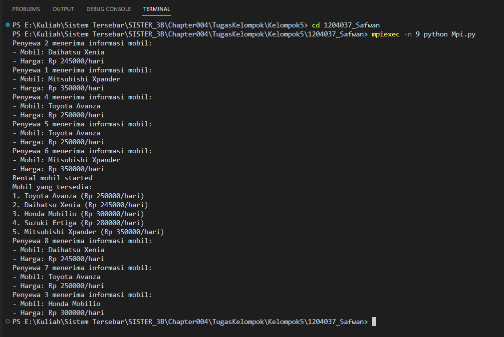

## Tema : Rental Mobil

## Penjelasan Kode Program
kode tersebut adalah untuk melakukan simulasi rental mobil dengan menggunakan MPI (Message Passing Interface) pada Python. MPI adalah sebuah standar yang digunakan untuk melakukan komunikasi antar proses pada sistem paralel dan terdistribusi.

Pada kode tersebut, proses 0 berperan sebagai server yang akan mengirimkan informasi mobil ke setiap proses penyewa. Informasi mobil yang dikirimkan berupa nama mobil dan harga sewa per hari. Sedangkan proses-proses penyewa akan menerima informasi mobil yang dikirimkan oleh proses 0 dan menampilkan informasi tersebut di layar.

Dengan menggunakan MPI, simulasi rental mobil ini dapat dilakukan secara paralel dengan memanfaatkan beberapa prosesor dalam sistem yang terhubung dengan jaringan MPI. Sehingga, proses komunikasi antar proses penyewa dan proses server dapat dilakukan secara efisien dan cepat.

## Hasil Output :
