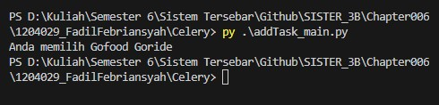

## Studi Kasus : Gojek Gofood dan Goride

### Penjelasan
Sebelum menjalankan program addTask_main.py dan addTask.py pastikan harus sudah ada terinstall Celery dan RabbitMQ pada komputer atau laptop yang dugunakan.Jika belum melakukan installasi Celery dan Rabbit MQ bisa melakukan installasi dengan cara "pip install celery" untuk celerynya dan untuk RabbitMQ nya bisa melakukan download di link tersebut "https://www.rabbitmq.com/install-windows.html"

Untuk Menjalankan program nya yaitu harus menjalankan addTask.py menggunakan celery yaitu dengan cara memasuki direktori yang ada program addTask.py lalu ketik "celery -A addTask worker --loglevel=info" ketika sudah dijalankan itu maka selanjutnya menjalankan program addTask_main.py dengan cara memasuki direktorinya lalu jalankan "py addTask_main.py" lalu hasilnya akan menyatukan teks yang outputnya "Anda memilih Gofood Goride"

### Hasil Running
