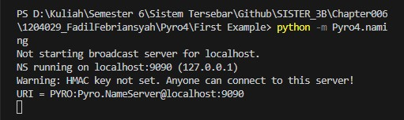

# Tema: Pemasanan Makanan Di GoFood

Sebelum menjalankan program pyro_client.py dan pyro_server.py pastikan harus sudah ada terinstall pyro4 pada komputer atau laptop yang dugunakan.Jika belum melakukan installasi pyro4 bisa melakukan installasi dengan cara ```pip install pyro4 ``` untuk pyro4.

Untuk Menjalankan program nya yaitu harus menjalankan pyro4 nya terlebih dahulu dengan cara membuka terminal dan memasuki ke direktori pyro dan menjalankan ```python -m Pyro4.naming``` Jika sudah menjalankan pyro4 nya kita bisa melanjutkan untuk program pyro_server.py lalu menjalankan pyro_client.py yang artinya ada komunikasi diantara server dan client yang nantinya ketika dijalankan membutuhkan inputan (makanan) yang akan di pesan dan di cetak seperti gambar outputnya.


# Hasil Running

1. Menjalankan server pyro4

2. Server (pyro_server.py)

3. Client (pyro_client.py)
