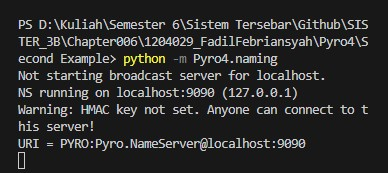
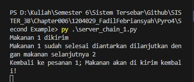
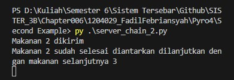
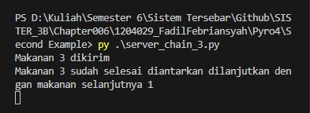
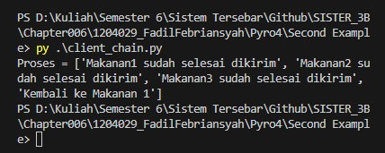

# Tema: Proses Pengantaran Makanan

Sebelum menjalankan program client_chain.py , server_chain1.py, server_chain2,dan server_chain3 pastikan harus sudah ada terinstall pyro4 pada komputer atau laptop yang dugunakan.Jika belum melakukan installasi pyro4 bisa melakukan installasi dengan cara ```pip install pyro4 ``` untuk pyro4.

Untuk Menjalankan program nya yaitu harus menjalankan pyro4 nya terlebih dahulu dengan cara membuka terminal dan memasuki ke direktori pyro dan menjalankan ```python -m Pyro4.naming``` Jika sudah menjalankan pyro4 nya kita bisa melanjutkan untuk program server  lalu menjalankan client yang artinya ada komunikasi diantara server dan client yang nantinya ketika dijalankan akan mencetak sesuai dengan urutan mulai dari server 1 server 2 server 3 dan akan kembali ke server 1 seperti gambar outputnya.

# Hasil Running

1. Menjalankan pyro4



2. Menjalankan program server chain 1, 2 dan 3





3. Menjalankan program client

