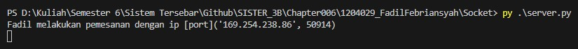
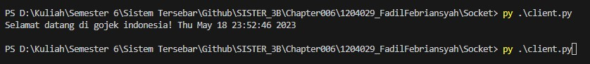
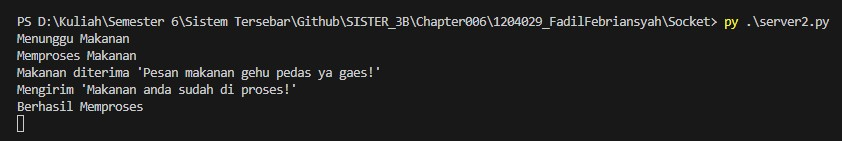
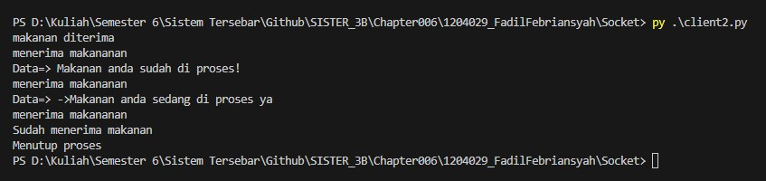

# Tema Client Server 1: Login gojek

File server.py ini mengimplementasikan server menggunakan socket untuk menerima koneksi dari klien, menangani permintaan, dan memberikan respons. Kode server ini dapat disesuaikan dengan logika bisnis atau kebutuhan aplikasi yang spesifik untuk mengelola permintaan klien.

File client.py ini dapat digunakan untuk berinteraksi dengan server yang telah diimplementasikan menggunakan socket. Klien dapat mengirim permintaan ke server, menerima respons, dan melakukan komunikasi lebih lanjut sesuai dengan logika bisnis yang ditetapkan dalam implementasi server tersebut.

# Hasil Running Program 1

1. Menjalankan program server1

2. Menjalakan program client1

# Tema Client Server 2: Proses Pemesanan Makanan

File server2.py berfungsi sebagai implementasi server dalam sistem komunikasi berbasis socket.Proses ini dimulai dengan menerima data yang dikirim oleh klien melalui koneksi yang telah dibuat. Selanjutnya, server membuka file yang ingin dikirimkan kepada klien. Dalam contoh ini, file yang dikirimkan bernama mytext.txt. Setelah data dikirim, server mencetak pesan bahwa data sedang dikirim dan mencetak data yang telah dikirim. Proses pengiriman data berlangsung dalam loop while hingga seluruh file telah dikirim.

File client2.py berfungsi sebagai implementasi client dalam sistem komunikasi berbasis socket.Proses ini mengirim pesan permintaan ke server.Setelah mengirim pesan permintaan, klien membuka file received.txt untuk menampung data makanan yang akan diterima. Klien menggunakan loop while untuk menerima data dari server.

# Hasil Running Program 2

1. Menjalankan program server2

2. Menjalakan program client2

