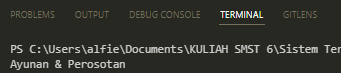

## Studi Kasus: Taman Bermain Anak

### Persiapan
Pastikan Celery dan RabbitMQ sudah terinstall terlebih dahulu, agar program pada folder ini dapat berjalan. Jalankan juga RabbitMQ server pada link yang sudah diatur pada file "addTask.py"

### Deskripsi
"addTask_main.py" merupakan file yang bertugas dalam menjalankan Celery. "addTask.py" di-impor pada file ini yang di mana "addTask.py" berfungsi sebagai pendefinisi serta pengaturan atau konfigurasi dari Celery.

Saat "addTast_main.py" dijalankan, function "add" atau task "add" akan dieksekusi menggunakan Celery. Value yang akan ditambahkan ditampung dalam variable "result" dengan nilai Taman Bermain Cimahi yang dipisah ke dalam 2 parameter.
  
# Output program

