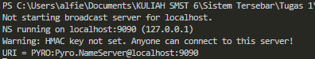
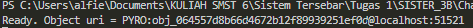
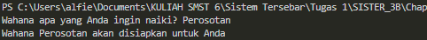

## Tema: Wahana Taman Bermain

Dalam file "pyro_client.py", terdapat fungsi yang berperan sebagai klien untuk berinteraksi dengan server Pyro. Di dalamnya, kita menggunakan Pyro4 untuk membuat proxy ke objek server dan memanggil metode "welcomeMessage" dengan memberikan nama wahana sebagai argumen. Sedangkan Dalam file "pyro_server.py", terdapat fungsi yang berperan sebagai server Pyro. Di dalamnya, kita mendefinisikan kelas "Server" yang memiliki metode "welcomeMessage" yang akan dipanggil oleh klien. Metode ini mengembalikan pesan sambutan yang mencakup nama wahana yang diberikan oleh klien.

Agar dapat menggunakan aplikasi ini, pastikan kita sudah menginstal Pyro4. Kita harus menjalankan server Pyro dengan menggunakan file "pyro_server.py" terlebih dahulu untuk mendaftarkan objek server di name server Pyro. Setelah itu, Kita bisa menjalankan file "pyro_client.py" untuk berkomunikasi dengan server dan mendapatkan pesan sambutan.

### Menjalankan Program
1. Nyalakan server pyro terlebih dahulu

```python
python -m Pyro4.naming
```

2. Jalankan server

```python
py pyro_server.py
```

3. Jalankan client dan ikutin perintahnya

```python
py pyro_client.py
```

### Hasil Program

1. Menjalankan server pyro4


2. Server


3. Client

