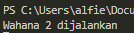
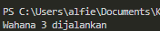
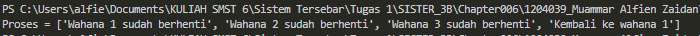

## Tema: Wahana Taman Bermain

Dalam file "chainTopology.py", terdapat definisi kelas "Chain" yang memiliki metode "process". Metode ini digunakan untuk memproses pesan dalam suatu rantai topologi. Setiap objek Chain memiliki nama dan nama server saat ini, dan memiliki kemampuan untuk memanggil metode process pada server berikutnya dalam rantai. Sedangkan dalam file "client_chain.py", terdapat fungsi yang berperan sebagai klien untuk berinteraksi dengan objek Chain. Di dalamnya, kita membuat proxy ke objek Chain menggunakan Pyro4 dan memanggil metode process dengan menyediakan pesan sebagai argumen.

File "server_chain_1.py", "server_chain_2.py", dan "server_chain_3.py" merupakan file-file yang berperan sebagai server dalam susunan topologi rantai. Tiap server akan menghasilkan sebuah objek Chain dengan mengatur server saat ini dan server yang berada setelahnya dalam rantai tersebut. Objek tersebut akan didaftarkan pada name server Pyro dengan menggunakan Pyro4, lalu server akan masuk ke dalam perulangan permintaan untuk menerima panggilan dari klien.

### Menjalankan Program

1. Nyalakan server Pyro4

```python
python -m Pyro4.naming
```


2. Menyalakan server chain 1, 2 dan 3

```python
py server_chain_1.py
```


```python
py server_chain_2.py
```


```python
py server_chain_3.py
```


3. Menjalankan program client

```python
py client_chain.py
```


