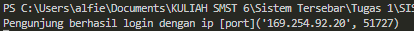
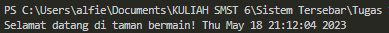
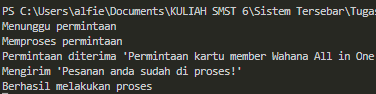
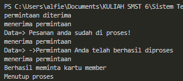

## Tema Client Server 1: Masuk Sistem Taman Bermain

Dalam file bernama "server.py", terdapat suatu file yang bertindak sebagai server. Di dalamnya, dilakukan pembuatan objek socket menggunakan modul socket, mengaitkannya dengan alamat tuan rumah dan port spesifik, lalu menerima koneksi yang masuk. Ketika terjadi koneksi masuk, kita menerima koneksi tersebut dan menampilkan informasi mengenai pengguna yang terhubung. Setelah itu, waktu saat ini dikirimkan ke klien dan koneksi ditutup.

Di dalam file "client.py", kita menemukan sebuah file yang berfungsi sebagai klien. Dalam skrip ini, kita menggunakan modul socket untuk membuat objek soket, dan kemudian kita melakukan koneksi ke server dengan menggunakan alamat host dan port yang identik. Setelah berhasil terhubung, data yang kita terima dari server adalah waktu saat ini. Kita mencetak pesan selamat datang beserta waktu yang diterima tersebut. Setelah langkah-langkah tersebut selesai, kita mengakhiri koneksi.

### Menjalankan Program 1

1. Menjalankan program server1
```python
py server.py
```


2. Menjalakan program client1
```python
py client.py
```



## Tema Client Server 2: Permintaan Kartu Member Wahana

Di dalam file "server2.py", terdapat fungsi sebagai server. Pada file tersebut, kita membuat objek socket menggunakan modul socket, menghubungkannya dengan alamat host dan port tertentu, dan selanjutnya melakukan pendengaran terhadap koneksi yang masuk. Setiap kali terdapat koneksi yang masuk, kita menerima pesan dari klien, membaca isi dari file "mytext.txt", dan mengirimkannya kepada klien. Setelah semua data terkirim, kita mengirimkan pesan konfirmasi kepada klien dan menutup koneksi.

Dalam file "client2.py", kita berperan sebagai klien. Di dalamnya, kita menggunakan modul socket untuk membuat objek soket dan terhubung ke server melalui alamat host dan port yang identik. Tindakan selanjutnya adalah mengirimkan pesan kepada server. Setelah itu, data dari server diterima dan dituliskan ke dalam file "received.txt". Setelah semua data selesai diterima, koneksi ditutup.

### Menjalankan Program 2

1. Menjalankan program server1
```python
py server2.py
```



2. Menjalakan program client1
```python
py client2.py
```

