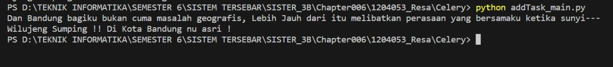

# Tema: Kota Bandung

File "addTask_main.py" adalah file utama yang berfungsi untuk menjalankan contoh penggunaan Celery. Di dalamnya, kita mengimpor modul "addTask" yang merupakan file kedua.

File "addTask.py" adalah file yang berisi definisi dan konfigurasi Celery. Di dalamnya, kita mendefinisikan sebuah task "add" yang menjumlahkan dua nilai.

Ketika menjalankan "addTask_main.py", task "add" akan dijalankan dengan menggunakan Celery. Dimana hasil dari penjumlahan "  Wilujeng Sumping !! ", "Di Kota Bandung nu asri !" akan dikembalikan sebagai hasil task dan dicetak sebagai pesan "Dan Bandung bagiku bukan cuma masalah geografis, Lebih Jauh dari itu melibatkan perasaan yang bersamaku ketika sunyi--- <hasil>". Sehingga akan menghasilkan kalimat berbunyi "Dan Bandung bagiku bukan cuma masalah geografis, Lebih Jauh dari itu melibatkan perasaan yang bersamaku ketika sunyi--- 
 Wilujeng Sumping !! ", "Di Kota Bandung nu asri !".
  
# Menjalankan Program
  
Untuk menjalankan aplikasi ini, pastikan menginstal Celery dan RabbitMQ terlebih dahulu. tidak lupa untuk menjalankan RabbitMQ server pada URL yang sesuai dengan konfigurasi di file "addTask.py".

  
# Hasil dari program
  
 
