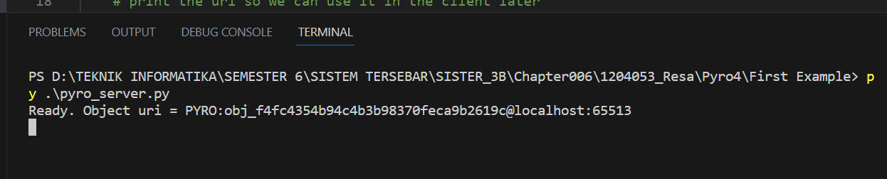
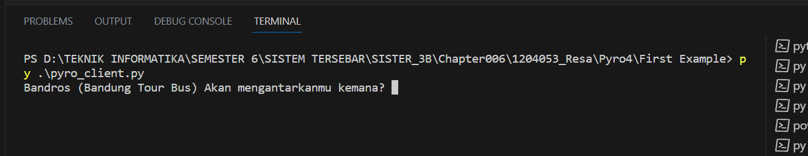

# Tema: Bandung Tour Bus


# Menjalankan Program
1. Nyalakan server pyro terlebih dahulu

```python
python -m Pyro4.naming
```
 

2. Jalankan server

```python
py pyro_server.py
```
 

3. Jalankan client dan ikutin perintahnya

```python
py pyro_client.py
```
 