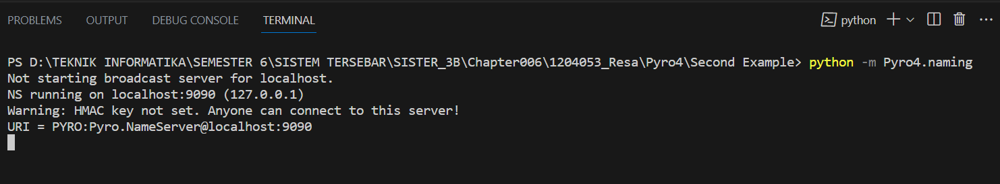
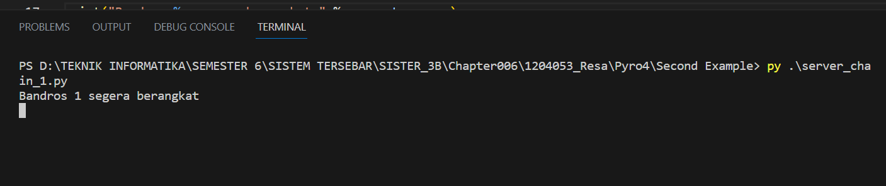
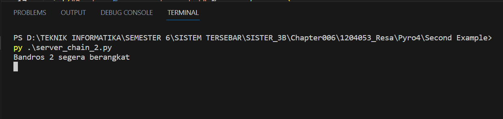
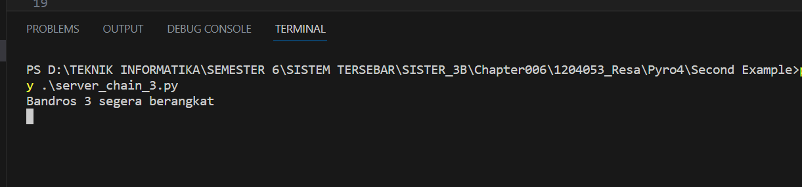
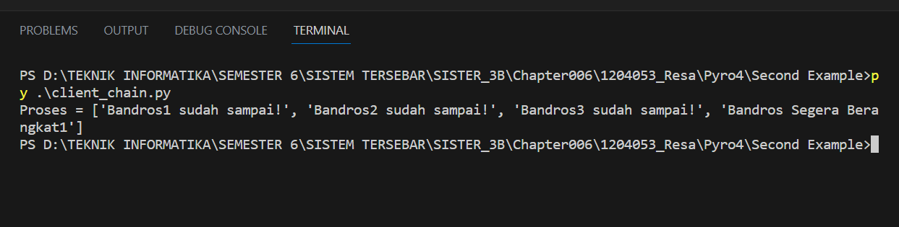

# Tema: Rute Bandung Tour Bus

# Menjalankan Program

1. Nyalakan server Pyro4

```python
python -m Pyro4.naming
```
 

2. Menyalakan server chain 1, 2 dan 3

```python
py server_chain_1.py
```



```python
py server_chain_2.py
```


```python
py server_chain_3.py
```


3. Menjalankan program client

```python
py client_chain.py
```



File "chainTopology.py" adalah file yang mendefinisikan kelas Chain yang memiliki metode process. Metode ini digunakan untuk memproses pesan dalam sebuah rantai topologi. Setiap objek Chain memiliki nama dan nama server saat ini, serta memiliki kemampuan untuk memanggil metode process pada server berikutnya dalam rantai

File "client_chain.py" adalah file yang berfungsi sebagai client untuk berinteraksi dengan objek Chain. Di dalamnya, kita membuat proxy ke objek Chain dengan menggunakan Pyro4 dan memanggil metode process dengan menyediakan pesan sebagai argumen.

File "server_chain_1.py", "server_chain_2.py", dan "server_chain_3.py" adalah file-file yang berfungsi sebagai server dalam rantai topologi. Setiap server akan membuat objek Chain dengan mengatur server saat ini dan server berikutnya dalam rantai. Objek tersebut akan didaftarkan di name server Pyro menggunakan Pyro4, dan kemudian server akan memasuki loop permintaan untuk menerima panggilan dari client.