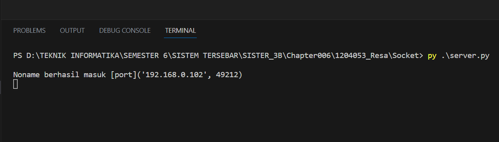
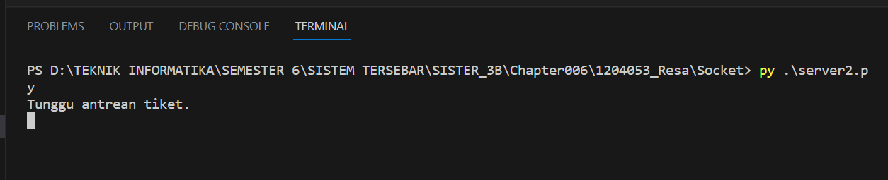
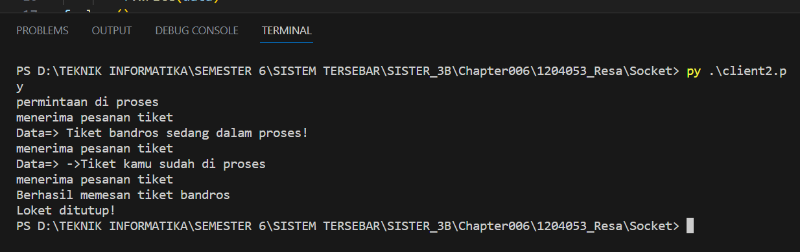

# Tema Client Server 1: Login website Terlarang

File "server.py" berperan sebagai file server. Di dalam file ini, kita membuat objek soket menggunakan modul soket, mengikatkannya ke alamat host dan port tertentu, dan kemudian menerima koneksi masuk. Setiap kali ada koneksi masuk, kita menerima koneksi tersebut dan mencetak informasi tentang pengguna yang terhubung. Selanjutnya, kita mengirimkan waktu saat ini ke klien dan menutup koneksi.

Sementara itu, file "client.py" berfungsi sebagai file klien. Di dalam file ini, kita membuat objek soket menggunakan modul soket, dan kemudian kita terhubung ke server menggunakan alamat host dan port yang sama. Setelah terhubung, kita menerima data dari server, yaitu waktu saat ini, dan mencetak pesan selamat datang bersama dengan waktu tersebut. Setelah itu, kita menutup koneksi.

# Menjalankan Program 1

1. Menjalankan program server1
```python
py server.py
```
 

2. Menjalakan program client1
```python
py client.py
```
 


# Tema Client Server 2

File "server2.py" adalah file yang berfungsi sebagai server. Dalam file ini, kita membuat socket objek menggunakan socket module, mengikatnya ke alamat host dan port tertentu, dan kemudian mendengarkan koneksi masuk. Setiap kali ada koneksi masuk, kita menerima pesan dari klien, membaca file "mytext.txt", dan mengirimkan isinya ke klien. Setelah semua data terkirim, kita mengirimkan pesan konfirmasi ke klien dan menutup koneksi.

File "client2.py" adalah file yang berfungsi sebagai klien. Dalam file ini, kita membuat socket objek menggunakan socket module dan terhubung ke server menggunakan alamat host dan port yang sama. 

# Menjalankan Program 2

1. Menjalankan program server2
```python
py server2.py
```
 


2. Menjalakan program client1
```python
py client2.py
```
 