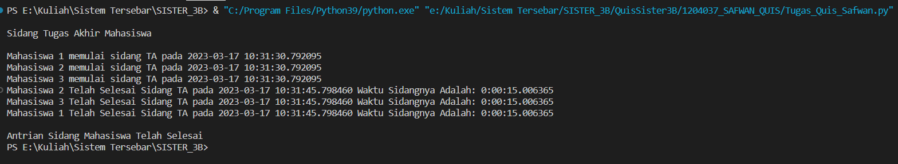

# Muhammad Sapwan Suhadi - 1204037
## STUDI KASUS : Tugas Akhir

- Pada tugas quis saya mengambil tema "Tugas Akhir" yang dimana pada alurnya terdapat 3 mahasiswa yang akan melakukan tugas akhir. Dalam prosesnya kode tersebut akan menunjukkan bahwa kapan ketiga mahasiswa sidang tersebut akan memulai sidang dan selesai melakukan sidang serta kode tersebut juga akan menampilkan lama waktu sidangnya mahasiswa tersebut secara berurutan. 

- Penjelasan Kode: "Pada kode tersebut, pertama-tama kita mengimpor modul threading, datetime, dan time. Kemudian, kita inisiasi sebuah barrier dengan jumlah thread yang akan dijalankan, dan pada contoh kode di atas, kita inisiasi barrier dengan jumlah 3 thread yang akan dijalankan. Selanjutnya, kita buat tiga fungsi mhs1(), mhs2(), dan mhs3() yang akan dijalankan pada setiap thread. Pada contoh kode di atas, setiap fungsi gungsi mhs hanya melakukan sleep selama 15 detik, tetapi Anda dapat mengganti bagian ini dengan tugas yang lebih kompleks sesuai dengan kebutuhan Anda. Pada setiap fungsi mhs(), kita memulai waktu eksekusi dengan mengambil waktu saat fungsi dijalankan menggunakan datetime.datetime.now(), dan kemudian mencetak waktu tersebut dengan format hari-detik-jam menggunakan strftime. Setelah tugas dijalankan selama 15 detik, kita selesaikan waktu eksekusi dengan mengambil waktu saat ini kembali menggunakan datetime.datetime.now(), dan mencetak waktu tersebut dengan format hari-detik-jam dan juga waktu eksekusi dari awal hingga akhir tugas. Setelah itu, kita menunggu semua thread selesai dijalankan menggunakan method barrier.wait(). Setelah semua thread selesai dijalankan, kita mencetak pesan "Antiran Mahasiswa Sidang Telah Selesai". Setelah itu, kita jalankan thread dan tunggu sampai semua thread selesai dijalankan dengan method join()."

## Hasil Running Program

