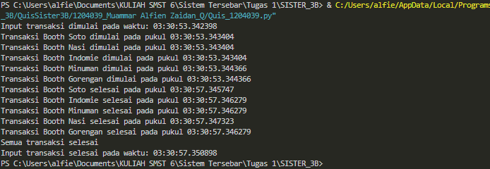

Pada quis ini saya membuat sebuah program untuk menjalankan sebuah list atau daftar transaksi. Tema atau studi kasus yang diterapkan yaitu Point of Sales Kantin, yang di mana objek transaksi merupakan booth atau lapak makanan yang ada di kantin. 

Pada bagian awal program merupakan proses import package yang diperlukan, di sini saya import threading disingkat tr, package time untuk melakukan jeda waktu atau sleep, serta datetime untuk menangkap waktu proses hingga ke satuan milidetik.

Selanjutnya yaitu melakukan proses definisi variabel utama serta fungsi-fungsi program. Variabel daftarTransaksi merupakan variabel yang berisi nama atau id dari transaksi yang akan dilakukan. Lalu terdapat definisi fungsi proses_transaksi, yang di mana merupakan fungsi yang menjalankan thread transaksi yang menerima dua parameter yaitu Barrier untuk sinkronisasi dan transaksi_id untuk nama thread.

Pada fungsi tersebut berisi pendefinisian dua variabel waktu. Yang pertama variable waktu untuk thread dimulai, dan variabel waktu untuk thread selesai dijalankan. Antara dua variabel tersebut terdapat time.sleep(4) yang berperan sebagai simulasi proses transaksi (simulasi dijalankan selama 4 detik). Lalu pada akhir fungsi terdapat barrier.wait() yang berfungsi untuk menunggu dan memastikan seluruh proses atau thread selesai dijalankan.

Lalu pada fungsi main() merupakan fungsi utama program. Pada fungsi tersebut terdapat variabel threads berupa array kosong yang nantinya akan diisi oleh sebuah looping berisi thread-thread dengan parameter Barrier yang merupakan panjang atau jumlah data daftarTransaksi serta nama item dari variabel daftarTransaksi. Thread tersebut ditambahkan dengan sebanyak jumlah data daftarTransaksi.

Lalu terdapat looping untuk thread dijalankan, serta thread di-join. Kedua looping tersebut merupakan looping untuk menjalankan thread dan menunggu proses thread selesai sebelum dilanjut ke bagian kode berikutnya. Setelah semua thread telah selesai dijalankan, program diakhiri dengan print bahwa seluruh transaksi telah selesai beserta waktunya.

Berikut ini merupakan hasil dari program yang telah dibuat:
