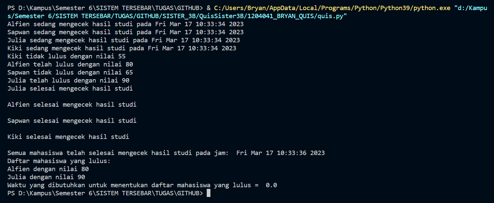

# Menggunakan Studi Kasus DHS (Data Hasil Studi)

## Hasil Output :

## Penjelasan :
- Dalam program ini, kita membuat sebuah simulasi untuk mengecek hasil studi dari beberapa mahasiswa. Pertama-tama, kita memulai dengan mengimport modul threading dan time. Selanjutnya, kita membuat sebuah class Mahasiswa yang memiliki atribut nama dan nilai, serta method cek_lulus yang digunakan untuk mengecek apakah mahasiswa tersebut lulus atau tidak.

- Dalam method cek_lulus, terdapat delay selama 2 detik untuk mensimulasikan waktu yang dibutuhkan untuk mengecek hasil studi. Jika nilai mahasiswa tersebut >= 70, maka mahasiswa tersebut lulus. Jika tidak, maka mahasiswa tersebut tidak lulus.

- Kemudian, kita membuat objek mahasiswa1, mahasiswa2, mahasiswa3, dan mahasiswa4 yang masing-masing merepresentasikan data hasil studi mahasiswa. Setelah itu, untuk setiap objek mahasiswa, dibuat thread baru dengan target method cek_lulus dan thread tersebut dijalankan.

- Setelah semua thread selesai, dilakukan join pada semua thread untuk memastikan bahwa semua thread telah selesai dijalankan. Selanjutnya, dilakukan pencarian mahasiswa yang lulus dengan nilai >= 70 dari daftar mahasiswa yang telah didefinisikan sebelumnya menggunakan list comprehension dan ditampilkan daftar mahasiswa yang lulus.

- Terakhir, ditampilkan waktu yang dibutuhkan untuk menentukan daftar mahasiswa yang lulus. Dengan program ini, kita dapat melihat bagaimana menggunakan threading untuk mengecek hasil studi dari beberapa mahasiswa secara paralel.
