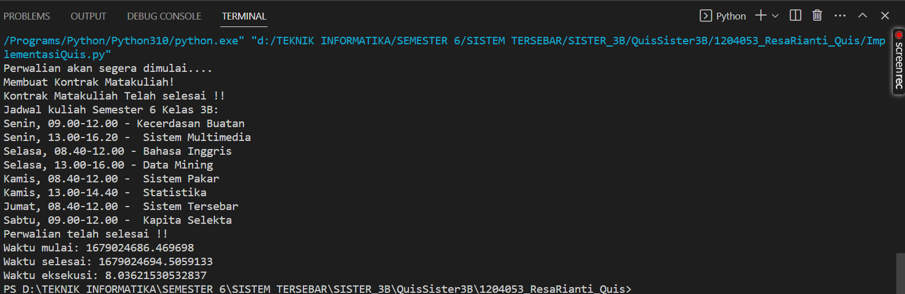

QUIS SISTEM TERSEBAR

jum'at, 17 Maret 2023

Nama : Resa Rianti
Npm  : 1204053
Kelas : D4 Teknik Informatika 3B
Studi Kasus : Perwalian

Narasi : 

Kode tersebut adalah contoh implementasi multithreading pada Python yang menggunakan module threading untuk membuat program yang mengakses data yang sama secara bersamaan.

Pada program ini, terdapat dua fungsi yang dijalankan oleh dua thread yang berbeda, yaitu buat_jadwal dan perwalian. Fungsi buat_jadwal akan menambahkan jadwal kuliah ke dalam list jadwal_kuliah, sedangkan fungsi perwalian akan menampilkan jadwal kuliah yang sudah dibuat.

Pada class JadwalKuliah, terdapat method tambah_jadwal dan lihat_jadwal yang dilakukan pada list jadwal. Dalam implementasinya, tambah_jadwal menggunakan mutex atau mutual exclusion untuk mengakses data jadwal secara bergantian, agar tidak terjadi konflik data ketika dua thread mengakses data yang sama secara bersamaan.

Pada fungsi buat_jadwal dan perwalian, terdapat argumen jadwal_kuliah dan barrier. jadwal_kuliah akan digunakan untuk memanggil method tambah_jadwal dan lihat_jadwal pada class JadwalKuliah, sedangkan barrier digunakan untuk memastikan bahwa kedua thread telah selesai melakukan tugasnya sebelum melanjutkan tugas selanjutnya.

Pada bagian akhir kode, terdapat pengukuran waktu eksekusi program menggunakan time.time(). Program menampilkan waktu mulai, waktu selesai, dan waktu eksekusi program.

Hasilnya:

Hasil dari implementasi Quis oleh seorang mahasiswa bernama Resa Rianti yang diberikan pada semester 6 kelas 3B pada mata kuliah Sistem Tersebar. Hasil tersebut menunjukkan bahwa perwalian akan segera dimulai dan setelah itu kontrak matakuliah akan dibuat. Kemudian, jadwal kuliah untuk semester tersebut diumumkan. Jadwal kuliah tersebut mencakup beberapa mata kuliah seperti Kecerdasan Buatan, Sistem Multimedia, Bahasa Inggris, Data Mining, Sistem Pakar, Statistika, Sistem Tersebar, dan Kapita Selekta. Pesan juga menunjukkan bahwa perwalian telah selesai dan memberikan informasi tentang waktu mulai, waktu selesai, dan waktu eksekusi untuk implementasi Quis oleh Resa Rianti.

