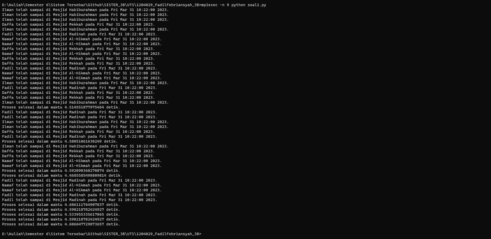
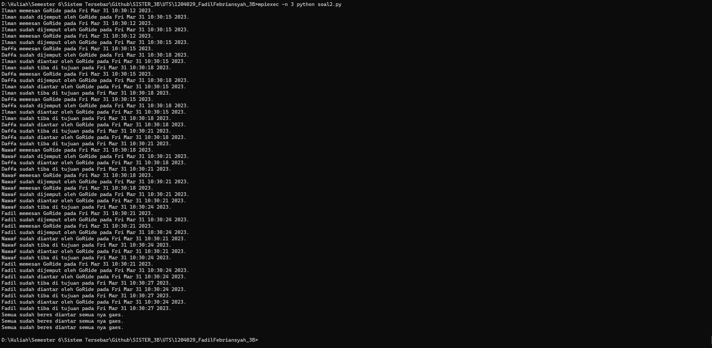
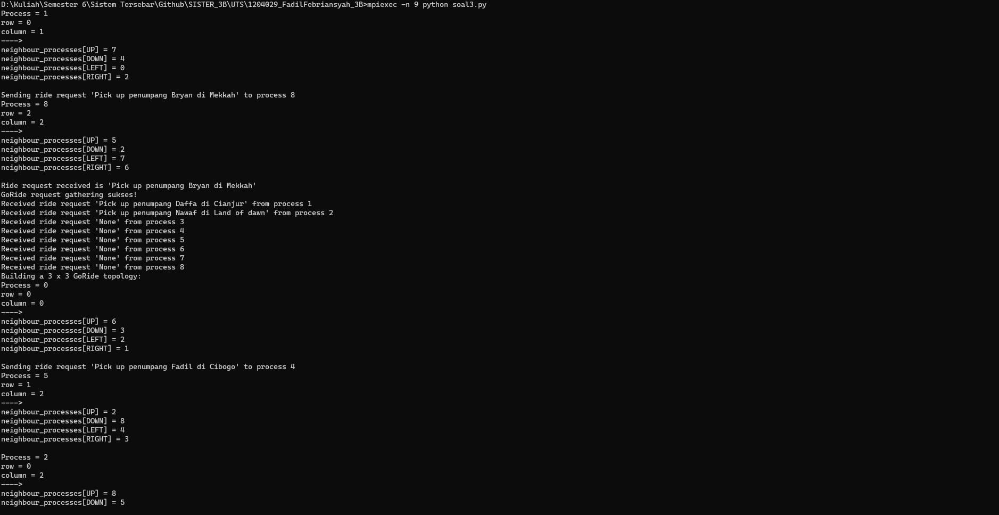

# UTS SISTER
## Fadil Febriansyah 1204029
### Penjelasan 

- Soal 1
Code ini untuk melakukan simulasi dengan studikasus layanan transportasi online GoRide dengan menggunakan multiprocessing, sehingga beberapa penumpang dapat dipesan secara parallel. Dengan menggunakan multiprocessing, program ini dapat mengurangi waktu yang diperlukan untuk menyelesaikan beberapa tugas secara bersamaan, sehingga waktu yang dibutuhkan untuk menyelesaikan semua proses menjadi lebih singkat.

- Soal 2
Code ini untuk melakukan simulasi dengan studikasus layanan transportasi online GoRide dengan menggunakan multiprocessing.Setiap proses tersebut dijalankan pada proses terpisah menggunakan multiprocessing, sehingga proses tersebut dapat dilakukan secara paralel. Kemudian, proses-proses tersebut dijalankan untuk setiap pelanggan pada daftar customers, dan setelah selesai, diakhiri dengan mencetak pesan "Semua sudah beres diantar semua nya gaes." Kode tersebut bertujuan untuk mengilustrasikan cara menggunakan multiprocessing untuk mempercepat eksekusi program dengan memanfaatkan kemampuan multithreading pada CPU.

- Soal 3
Code ini menggunakan MPI dengan mengimport mpi4py. Program tersebut mencakup pemanfaatan topologi grid dalam MPI, di mana setiap proses akan memiliki 4 tetangga yang terhubung langsung dengan proses tersebut, yaitu tetangga atas (UP), bawah (DOWN), kiri (LEFT), dan kanan (RIGHT). Program ini juga memanfaatkan fungsi collectives seperti gather untuk mengumpulkan permintaan GoRide dari proses lain ke proses dengan rank 0, serta send dan recv untuk mengirim dan menerima permintaan GoRide antar proses.Selain itu, program di atas juga menggunakan point-to-point communication (ptpc) menggunakan fungsi comm.send dan comm.recv untuk mengirim dan menerima permintaan GoRide antar proses secara langsung.
