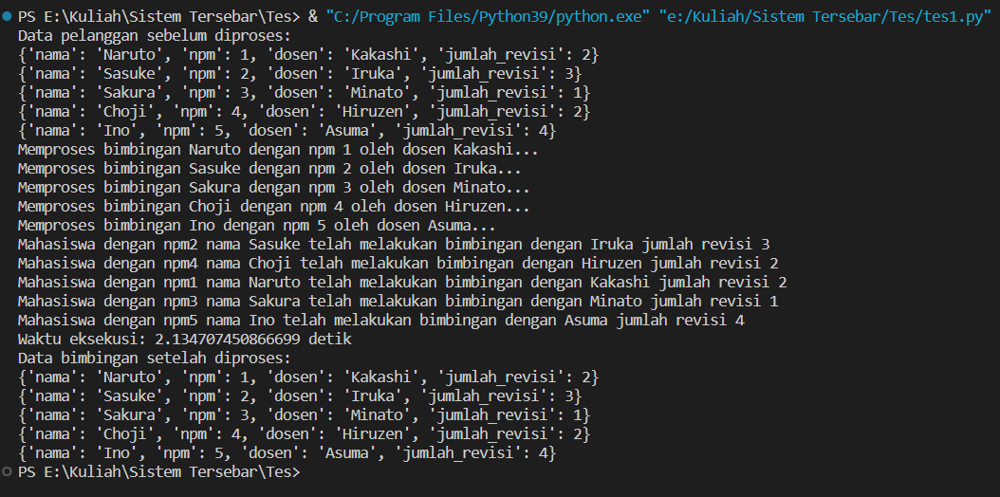
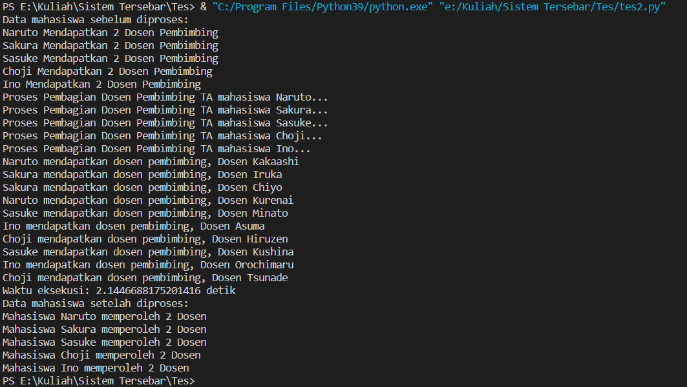
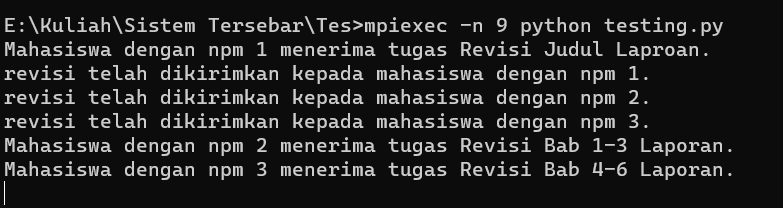

# Muhammad Sapwan Suhadi - 1204037
## STUDI KASUS : Bimbingan Mahasiswa

- File 1 : Tujuan dari kode tersebut adalah untuk memproses bimbingan mahasiswa secara parallel menggunakan multiprocessing di Python. Setiap mahasiswa akan diproses oleh proses yang berbeda-beda agar proses tersebut dapat berjalan secara parallel. Proses tersebut akan memanggil fungsi process_student_guidance() untuk memproses bimbingan mahasiswa dengan parameter yang berasal dari data mahasiswa yang bersangkutan. Setelah semua proses selesai, data mahasiswa akan dicetak ulang untuk memastikan bahwa data tersebut tidak mengalami perubahan selama proses.

- File 2 : Tujuan dari kode tersebut adalah untuk memproses data mahasiswa yang terdiri dari nama mahasiswa dan dosen pembimbingnya. Kode tersebut menggunakan multiprocessing di Python untuk memproses data mahasiswa secara parallel. Setiap mahasiswa akan diproses oleh proses yang berbeda-beda agar proses tersebut dapat berjalan secara parallel. Proses tersebut akan memanggil fungsi process_student_data() untuk memproses data mahasiswa dengan parameter yang berasal dari data mahasiswa yang bersangkutan. Setelah semua proses selesai, data mahasiswa akan dicetak ulang untuk memastikan bahwa data tersebut tidak mengalami perubahan selama proses.

- File 3 : Kode tersebut merupakan contoh penggunaan MPI (Message Passing Interface) pada Python menggunakan library mpi4py. MPI digunakan untuk mengimplementasikan pemrograman paralel dengan melakukan komunikasi dan koordinasi antara proses yang berjalan pada beberapa node dalam suatu jaringan komputer.

Dalam kode tersebut, setiap proses yang dijalankan akan memperoleh nomor proses (npm) yang berbeda-beda. Jika nomor proses sama dengan 0, maka program akan mengirimkan tugas revisi kepada mahasiswa lain (dalam contoh ini diimplementasikan sebagai proses dengan npm 1, 2, dan 3). Sedangkan jika nomor proses tidak sama dengan 0, maka program akan menerima tugas revisi dari proses dengan npm 0.

Dengan menggunakan MPI, program tersebut dapat meningkatkan efisiensi pemrosesan data dan mempercepat waktu eksekusi program dengan memanfaatkan sumber daya komputasi yang tersedia secara paralel.

## Hasil Running Program

-File 1:

-File 2:

-File 3:
