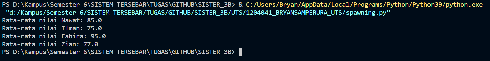
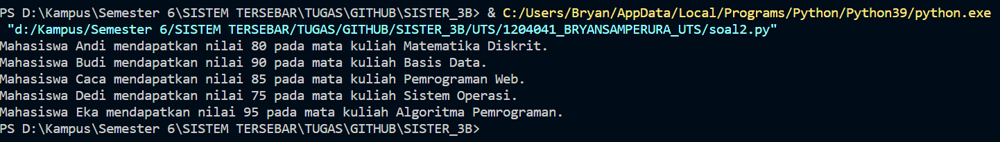
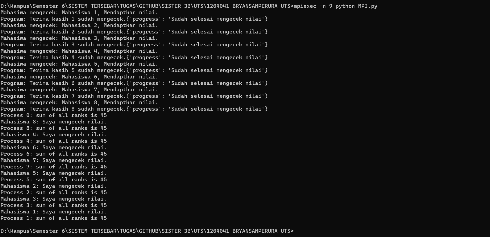

## Soal 1 : Spawning.py
Mengecek nilai dengan dan rata daha DHS Mahasiswa

## Soal 2 : soal2.py
Mengecek nilai dan nama matakuliah

## Soal 3 : MPI.py
Melakukan Komunikasi antara Program dan Mahasiswa

